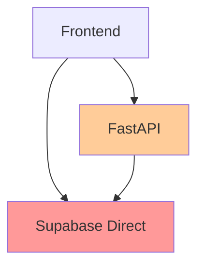
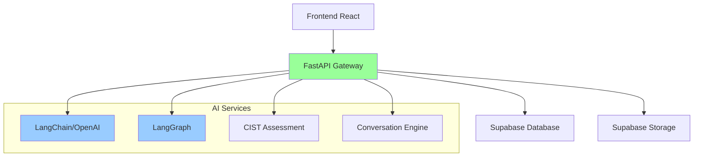

# 아키텍처 개선 방향 및 구현 계획

**작성일**: 2025-08-18 17:45  
**작성자**: AI Assistant  
**목적**: T-004 구현 후 백엔드 아키텍처 최적화 방안 제시

---

## 📋 현재 상태 분석

### 기존 아키텍처의 문제점



**문제점:**
1. **중복 통신 경로**: Frontend가 Supabase와 FastAPI 모두 직접 통신
2. **FastAPI 역할 모호**: 단순 프록시 역할로 존재 가치 부족
3. **AI 기능 미구현**: LangChain, LangGraph 등 핵심 기능 부재
4. **보안 정책 분산**: Supabase RLS와 FastAPI JWT가 별도 동작

---

## 🎯 개선된 아키텍처

### 목표 아키텍처



### 역할 재정의

#### 1. **Frontend (React)**
- **단일 API 엔드포인트**: FastAPI만 통신
- **UI/UX 집중**: 사용자 인터페이스 전담
- **상태 관리**: 클라이언트 상태만 관리

#### 2. **FastAPI (API Gateway + AI Hub)**
- **API 게이트웨이**: 모든 외부 요청 통합 처리
- **AI 서비스 허브**: LangChain, LangGraph 통합
- **비즈니스 로직**: CIST 평가, 회상 대화 엔진
- **인증 관리**: JWT 기반 통합 인증

#### 3. **Supabase**
- **데이터 스토어**: PostgreSQL 데이터베이스
- **파일 스토리지**: 이미지, 오디오 파일 관리
- **RLS 보안**: 데이터 레벨 보안 정책

---

## 🛠️ 구체적 구현 계획

### Phase 1: FastAPI AI 서비스 확장

#### 1.1 의존성 추가
```toml
# backend/pyproject.toml
[tool.poetry.dependencies]
# 기존 의존성 유지
langchain = "^0.1.0"
langchain-openai = "^0.1.0" 
langgraph = "^0.1.0"
openai = "^1.0.0"
pydantic-ai = "^0.0.12"
tiktoken = "^0.6.0"
```

#### 1.2 AI 서비스 계층 구성
```
backend/app/
├── services/
│   ├── __init__.py
│   ├── ai_service.py          # 기본 AI 서비스
│   ├── conversation_service.py # 회상 대화 엔진
│   ├── cist_service.py        # CIST 평가 로직
│   └── photo_analysis.py      # 사진 분석 서비스
├── agents/                    # LangGraph 에이전트
│   ├── __init__.py
│   ├── conversation_agent.py
│   └── assessment_agent.py
└── prompts/                   # AI 프롬프트 템플릿
    ├── __init__.py
    ├── conversation_prompts.py
    └── cist_prompts.py
```

#### 1.3 핵심 서비스 구현

**AI 서비스 기본 클래스**
```python
# backend/app/services/ai_service.py
from langchain.chat_models import ChatOpenAI
from langchain.schema import BaseMessage
from typing import List, Dict, Any

class AIService:
    def __init__(self):
        self.llm = ChatOpenAI(
            model="gpt-4",
            temperature=0.7
        )
    
    async def generate_response(
        self, 
        messages: List[BaseMessage]
    ) -> str:
        """AI 응답 생성"""
        pass
    
    async def analyze_photo(
        self, 
        photo_url: str, 
        user_context: Dict[str, Any]
    ) -> Dict[str, Any]:
        """사진 분석 및 대화 소재 생성"""
        pass
```

**CIST 평가 서비스**
```python
# backend/app/services/cist_service.py
from typing import List, Dict, Optional
from ..models.session import CISTCategory, CISTResponse

class CISTService:
    async def generate_question(
        self, 
        category: CISTCategory,
        difficulty: int = 1
    ) -> Dict[str, str]:
        """CIST 카테고리별 질문 생성"""
        pass
    
    async def evaluate_response(
        self,
        question: str,
        expected: str,
        user_response: str
    ) -> CISTResponse:
        """사용자 응답 평가 및 점수 계산"""
        pass
    
    async def calculate_total_score(
        self,
        session_id: str
    ) -> Dict[str, Any]:
        """세션별 CIST 총점 계산"""
        pass
```

**회상 대화 서비스**
```python
# backend/app/services/conversation_service.py
from langgraph import StateGraph
from typing import Dict, List, Any

class ConversationService:
    def __init__(self):
        self.conversation_graph = self._build_conversation_graph()
    
    def _build_conversation_graph(self) -> StateGraph:
        """대화 흐름 그래프 생성"""
        pass
    
    async def start_conversation(
        self,
        user_id: str,
        photo_ids: List[str]
    ) -> str:
        """새 회상 대화 세션 시작"""
        pass
    
    async def process_user_input(
        self,
        session_id: str,
        user_input: str
    ) -> Dict[str, Any]:
        """사용자 입력 처리 및 다음 질문 생성"""
        pass
```

### Phase 2: API 엔드포인트 통합

#### 2.1 새로운 라우터 추가
```python
# backend/app/routers/ai_router.py
from fastapi import APIRouter, Depends
from ..services.conversation_service import ConversationService
from ..services.cist_service import CISTService

router = APIRouter(prefix="/ai", tags=["ai"])

@router.post("/conversations/start")
async def start_conversation(
    photo_ids: List[str],
    current_user_id: str = Depends(get_current_user_id)
):
    """회상 대화 시작"""
    pass

@router.post("/cist/question")
async def generate_cist_question(
    category: str,
    difficulty: int = 1
):
    """CIST 질문 생성"""
    pass

@router.post("/cist/evaluate")
async def evaluate_cist_response(
    question_id: str,
    user_response: str
):
    """CIST 응답 평가"""
    pass
```

#### 2.2 기존 엔드포인트 개선
- **사진 업로드**: AI 기반 자동 태그 생성
- **앨범 관리**: 스마트 분류 기능 추가
- **사용자 프로필**: 인지 상태 추적 정보 포함

### Phase 3: Frontend 통합 개선

#### 3.1 API 클라이언트 통합
```typescript
// frontend/src/lib/api.ts
class APIClient {
  private baseURL = 'http://localhost:8000/api/v1';
  
  // Supabase 직접 호출 제거
  async uploadPhoto(file: File, metadata: any) {
    // FastAPI 경유 업로드
  }
  
  async startConversation(photoIds: string[]) {
    // AI 대화 시작
  }
  
  async submitCISTResponse(response: any) {
    // CIST 응답 제출
  }
}
```

#### 3.2 상태 관리 개선
```typescript
// frontend/src/contexts/AIContext.tsx
interface AIContextType {
  currentSession: Session | null;
  conversationHistory: Message[];
  cistProgress: CISTProgress;
  startConversation: (photoIds: string[]) => Promise<void>;
  submitResponse: (response: string) => Promise<void>;
}
```

---

## 📊 구현 우선순위

### 🚀 High Priority (1-2주)
1. **AI 서비스 기본 구조** 구축
   - OpenAI API 연동
   - 기본 대화 엔진 구현
   - CIST 질문 생성 로직

2. **API 게이트웨이화**
   - Frontend → FastAPI 단일 통신
   - Supabase 직접 호출 제거

### 📈 Medium Priority (3-4주)  
3. **LangGraph 대화 흐름** 구현
   - 상태 기반 대화 관리
   - 개인화 대화 로직

4. **CIST 평가 자동화**
   - 응답 분석 AI
   - 실시간 점수 계산

### 🔧 Low Priority (1-2개월)
5. **고도화 기능**
   - 음성 인식/합성
   - 감정 분석
   - 개인화 추천

---

## 🔐 보안 및 성능 고려사항

### 보안
- **API 키 관리**: 환경변수 분리
- **토큰 검증**: JWT 기반 통합 인증
- **데이터 검증**: Pydantic 모델 활용

### 성능
- **캐싱 전략**: Redis 도입 검토
- **비동기 처리**: FastAPI async/await 활용
- **AI API 최적화**: 토큰 사용량 모니터링

---

## 📝 다음 단계

1. **환경 설정**
   ```bash
   cd backend
   poetry add langchain langchain-openai langgraph openai
   ```

2. **OpenAI API 키 설정**
   ```env
   OPENAI_API_KEY=your_openai_api_key
   ```

3. **AI 서비스 기본 구조** 구현 시작
   - `/backend/app/services/ai_service.py` 생성
   - 기본 ChatGPT 연동 테스트

4. **점진적 마이그레이션**
   - 사진 업로드 API부터 AI 기능 통합
   - Frontend 호출 경로 단계적 변경

---

## 💡 추가 제안사항

### 개발 도구
- **API 문서화**: FastAPI 자동 문서 활용
- **테스트 코드**: pytest 기반 AI 서비스 테스트
- **모니터링**: AI API 사용량 추적

### 확장 가능성
- **다국어 지원**: 한국어/영어 CIST 평가
- **클라우드 배포**: Docker 컨테이너화
- **모바일 앱**: React Native 확장

---

*이 문서는 현재 코드베이스 분석을 바탕으로 작성되었으며, 실제 구현 시 세부사항은 조정될 수 있습니다.*